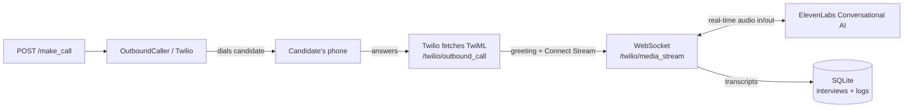

# Voice Interview

An AI voice interviewer that places an outbound phone call to a candidate, conducts a natural spoken screening interview in real time, and stores the conversation and transcript for the hiring team to review.

It bridges **Twilio** phone calls to **ElevenLabs Conversational AI** over WebSockets, wrapped in a **FastAPI** backend, with **CrewAI** agents for running the interview and analysing the result.

## How it works



1. You trigger a call by posting a phone number to `/make_call`.
2. `OutboundCaller` uses the Twilio API to dial the candidate.
3. When they answer, Twilio requests TwiML from `/twilio/outbound_call`, which plays a short greeting and opens a media stream to the FastAPI WebSocket.
4. The `/twilio/media_stream` WebSocket pipes the call audio to ElevenLabs Conversational AI and streams the agent's spoken replies back to the caller in real time (base64 audio, ping/pong keep-alive).
5. User and agent transcripts are captured and written to a local SQLite database so the team can read the interview afterwards.

A static **ngrok** domain exposes the local FastAPI server so Twilio can reach the webhooks and WebSocket.

## Tech stack

- **Backend:** Python, FastAPI, Uvicorn, WebSockets
- **Telephony:** Twilio Voice + Media Streams
- **Voice AI:** ElevenLabs Conversational AI
- **LLM / agents:** OpenAI, CrewAI (interviewer and analyst agents in `config/agents.yaml` and `config/tasks.yaml`)
- **Storage:** SQLite (via `db.py`), SQLAlchemy
- **Tunnelling:** ngrok (static domain)
- **Optional research tool:** Firecrawl website scraper for gathering context

## Project structure

```
src/voice_interview/
  main.py                  FastAPI app: /make_call, health, Twilio webhooks, media-stream WebSocket
  outbound_caller.py       Places Twilio calls and generates the call TwiML
  elevenlabs_handler.py    Manages the ElevenLabs Conversational AI WebSocket (audio, transcripts)
  db.py                    SQLite schema and helpers (interviews + conversation logs)
  crew.py                  CrewAI crew definition
  interviewer_agent.py     Interview agent logic
  config/agents.yaml        Agent roles (interviewer, analyst)
  config/tasks.yaml         Interview stages and transcript-analysis task
  tools/                   Custom CrewAI tools (incl. Firecrawl website scraper)
setup/setup_twilio_webhook.py   One-time: point your Twilio number at the ngrok webhook
start_voice_system.py      Starts ngrok + FastAPI together
```

## Prerequisites

- Python 3.10–3.13
- A Twilio account with a voice-capable phone number
- An ElevenLabs account with a Conversational AI agent (you'll need its Agent ID)
- An OpenAI API key
- ngrok with a reserved static domain
- (Optional) a Firecrawl API key for the research tool

## Setup

1. **Install dependencies**

   ```bash
   # with uv (recommended)
   uv sync

   # or with pip
   pip install -r requirement.txt
   ```

2. **Configure environment**

   ```bash
   cp .env_example .env
   ```

   Fill in `.env`:

   ```
   OPENAI_API_KEY=
   MODEL=

   ELEVENLABS_API_KEY=
   ELEVENLABS_AGENT_ID=

   TWILIO_ACCOUNT_SID=
   TWILIO_AUTH_TOKEN=
   TWILIO_PHONE_NUMBER=

   FIRECRAWL_API_KEY=

   NGROK_API_KEY=
   NGROK_URL=https://your-static-domain.ngrok-free.app

   DATABASE_URL=sqlite:///./voice_interviews.db
   ```

   Set `NGROK_URL` to your own reserved ngrok domain. The same value is referenced in
   `start_voice_system.py` and `setup/setup_twilio_webhook.py`, so update it there too.

3. **Point Twilio at your webhook (one time)**

   ```bash
   python setup/setup_twilio_webhook.py
   ```

## Running

```bash
python start_voice_system.py
```

This launches the ngrok tunnel and the FastAPI server on port 8000. Then start an interview call:

```bash
curl -X POST http://localhost:8000/make_call \
  -H "Content-Type: application/json" \
  -d '{"phone_number": "+1234567890"}'
```

The candidate's phone rings, the AI interviewer takes over the conversation, and the transcript lands in `voice_interviews.db`.

## Key endpoints

| Method | Path | Purpose |
| ------ | ---- | ------- |
| POST | `/make_call` | Start an outbound interview call |
| POST | `/start_interview` | Alias for `/make_call` |
| GET  | `/health` | Health check and active config |
| POST | `/twilio/outbound_call` | Returns the call TwiML (greeting + stream) |
| WS   | `/twilio/media_stream` | Real-time audio bridge to ElevenLabs |
| POST | `/twilio/status_callback` | Twilio call status updates |
| GET  | `/docs` | Interactive API docs |

## Notes

- This is a personal/portfolio project. It runs locally behind ngrok with SQLite, not as a hosted production service.
- Never commit your real `.env`. All credentials are read from environment variables.
- The CrewAI analyst flow is set up to summarise and score transcripts; the live call itself is driven by the ElevenLabs agent configured in your dashboard.
